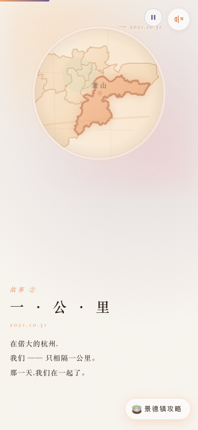
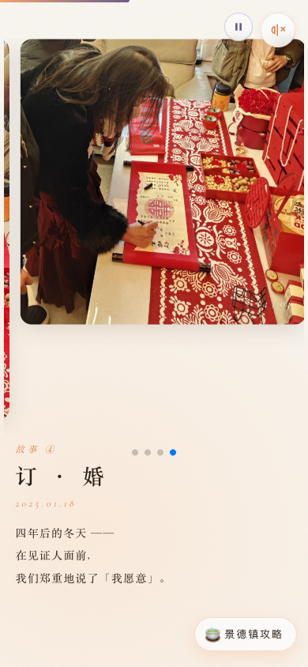
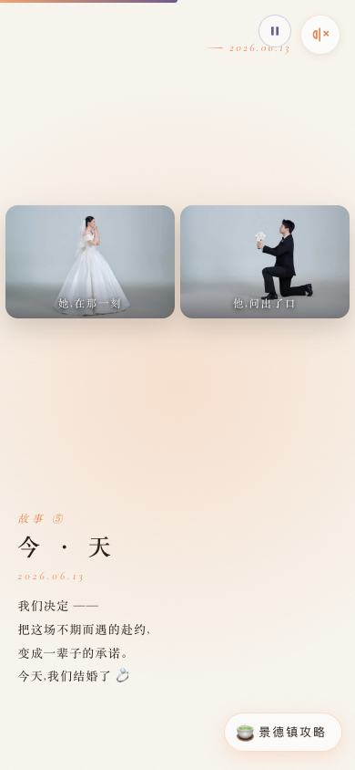

# 赴约 · 婚礼邀请函

> 一份用心制作的婚礼邀请函 H5 页面。
> 包含故事卡片、RSVP 表单、地图导航、倒计时、后台管理等功能。

<p align="center">
  
  
  
  
  
</p>

> 📱 移动端优先 · 全屏滑页 · 在线演示：[GitHub Pages](https://taohaowei.github.io/wedding-site/)

## 技术栈

| 前端 | 后端 |
|------|------|
| Vue 3 + TypeScript + Vite | Node 20 + TypeScript + Hono |
| SCSS 设计系统 (Design Tokens) | better-sqlite3 零依赖数据库 |
| GSAP 动画引擎 | zod 表单校验 |
| Vue Router + Pinia | vitest 单元测试 |

## 快速开始

```bash
# 启动前端开发服务
cd frontend
npm install
npm run dev

# 启动后端开发服务（另一个终端）
cd backend
cp .env.example .env     # 编辑 .env 填入 ADMIN_PASSWORD
npm install
npm run dev
```

打开 `http://localhost:5173` 预览。

## 在线演示（GitHub Pages）

前端纯静态部分可以直接部署到 GitHub Pages：

1. 推送代码到 GitHub 仓库
2. 仓库 Settings → Pages → **Source 选 "GitHub Actions"**
3. 如果仓库名不是 `<你的用户名>.github.io`，在 Settings → Actions → Variables 新建 `BASE_URL=/仓库名/`
4. 推送 `main` 分支，Actions 会自动构建部署

部署后访问 `https://<你的用户名>.github.io/<仓库名>/`。

> ⚠️ 注意：GitHub Pages 不支持后端，RSVP 提交和管理后台会以 **mock 模式** 运行（数据不持久化），适合作为视觉预览。如需完整功能请部署到自己的服务器。

## 后台管理（查看宾客信息）

👉 **在线体验（演示模式）**：<https://taohaowei.github.io/wedding-site/#/admin>

> 演示密码：`123`（GitHub Pages 无后端，登录后展示的是内置示例数据，可参考后台样式）

真实部署时，后端启动后访问部署域名的 `/admin` 路径登录（密码由 `ADMIN_PASSWORD` 环境变量设置）。

### 功能

| 功能 | 说明 |
|------|------|
| **RSVP 列表** | 查看所有宾客的到场确认、人数、住宿需求、饮食忌口、留言 |
| **CSV 导出** | 一键导出全部 RSVP 数据为 CSV 文件（含 IP、User-Agent） |
| **Session 鉴权** | 密码登录，7 天有效，HttpOnly Cookie |

### 使用方式

```bash
# 1. 设置管理员密码（环境变量，无默认值）
export ADMIN_PASSWORD=你的强密码

# 2. 启动后端
cd backend && npm run build && npm start

# 3. 访问后台
open http://localhost:3001/admin
```

登录后在后台可以看到：
- ✅ 谁确认到场 / 婉拒 / 未确定
- ✅ 每位宾客的随行人数
- ✅ 是否需要住宿、预计到达时间
- ✅ 饮食忌口和留言
- ✅ 一键导出 CSV（含 IP）

后台前端已集成在 Vite 构建产物中（`frontend/src/pages/AdminPage.vue`），无需额外部署。

## 项目结构

```
wedding-site/
├── frontend/          # Vue 3 前端
│   ├── src/
│   │   ├── sections/  # 全屏页面卡片
│   │   ├── components/# 通用组件
│   │   ├── data/      # 故事文案数据
│   │   ├── stores/    # Pinia 状态
│   │   └── styles/    # SCSS 设计系统
│   └── public/        # 静态资源
├── backend/           # Hono 后端
│   ├── src/
│   │   ├── routes/    # API 路由
│   │   ├── db/        # SQLite 数据库
│   │   └── middleware/# 鉴权 / CORS / 限流
│   └── tests/         # 单元测试
└── ops/               # 部署配置
    ├── nginx/         # Nginx 配置模板
    └── deploy/        # 部署脚本
```

## 功能

- 📖 **故事卡片** — GSAP 驱动的全屏故事动画（含杭州地图缩放 + 小区近景）
- 📝 **RSVP 表单** — 在线提交出席确认，含人数、住宿、饮食偏好
- 🗺 **地图导航** — 高德/百度地图一键导航到场地
- ⏱ **倒计时** — 婚礼日期实时倒计时
- 🎵 **背景音乐** — Mixkit 免费音乐（已获授权）
- 👨‍💼 **后台管理** — 查看 RSVP 列表、导出 CSV
- 📱 **移动优先** — 全响应式设计

## 使用前需要修改

1. **个人信息** — `frontend/src/data/stories.ts` 中的故事文案
2. **名称** — `frontend/src/sections/CoverSection.vue`、`frontend/index.html`
3. **场地和日期** — `frontend/src/sections/CoverSection.vue`、`frontend/src/sections/VenueSection.vue`
4. **环境变量** — `backend/.env` 设置 `ADMIN_PASSWORD`（无默认值，未设置会启动报错）
5. **CORS 域名** — `backend/src/middleware/cors.ts` 改为你的域名
6. **地图坐标** — `frontend/src/sections/VenueSection.vue` 中的示例坐标
7. **部署配置** — `ops/nginx/mynight.conf` 中的 `example.com` 改为你的域名
8. **分享卡片** — `frontend/index.html` 中的 `your-domain.com` 改为你的域名
9. **照片** — `frontend/public/photos/` 替换为你自己的照片

## 授权许可

MIT License — 详见 [LICENSE](./LICENSE)。

音乐 `frontend/public/audio/bgm.mp3` 使用 [Mixkit Free License](https://mixkit.co/license/)，归原作者所有。
