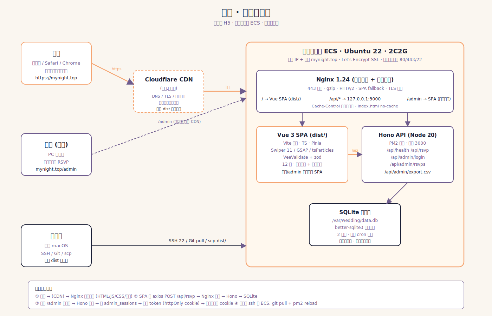
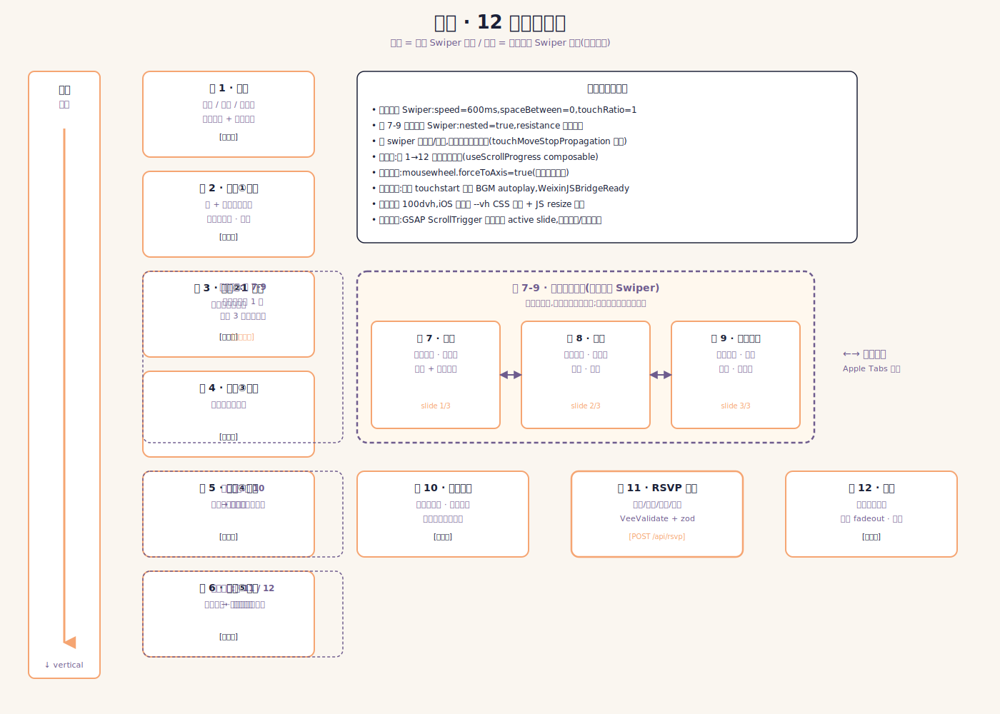
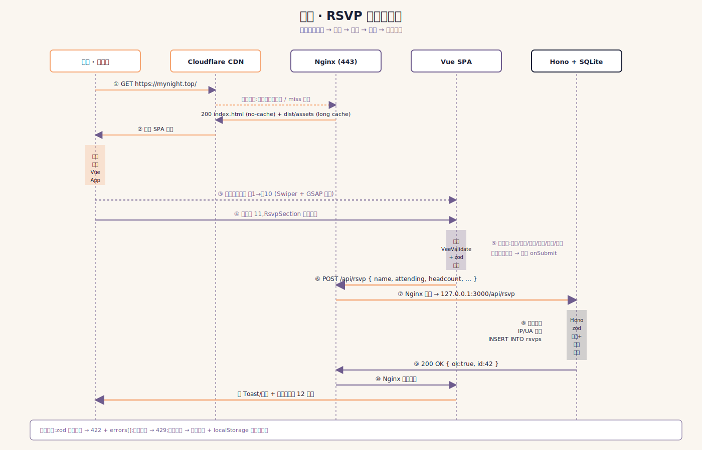
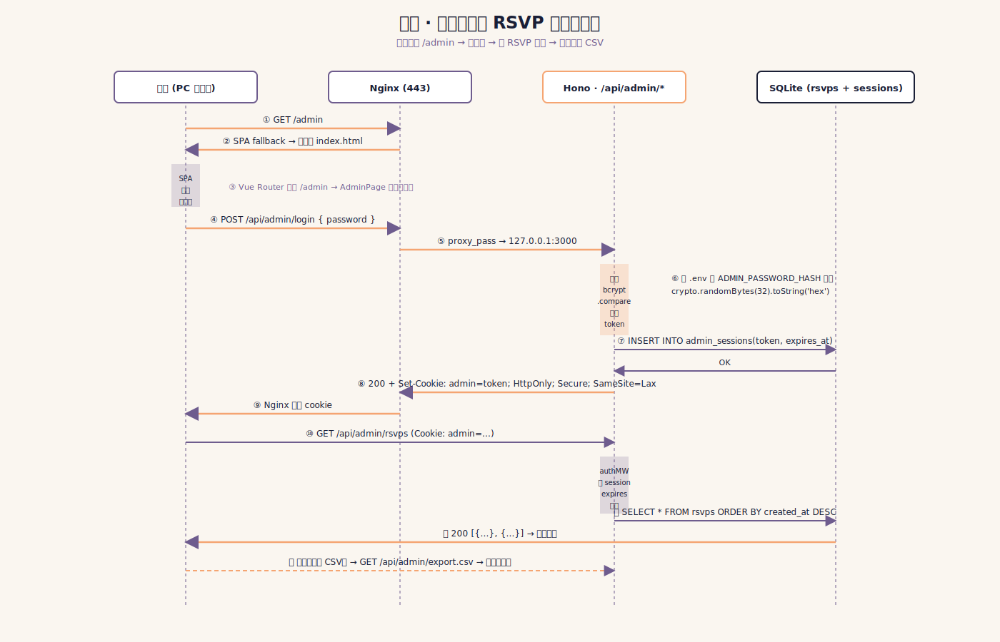
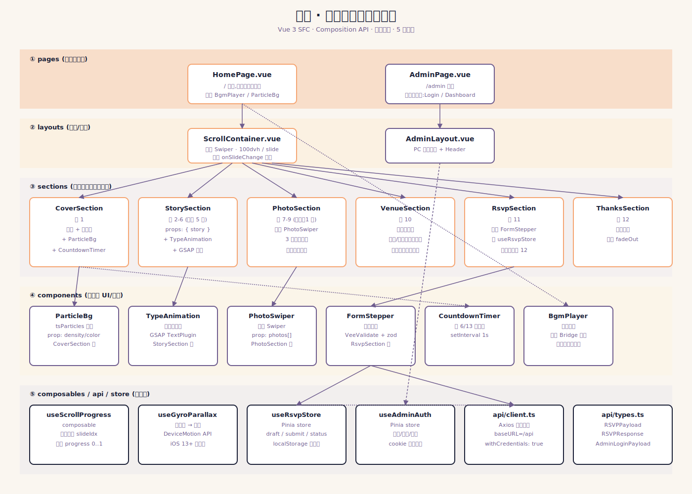

# 赴约 · 技术架构方案

> 婚礼请柬 H5 — 陶浩伟 & 刘雨晴 · 2026.06.13 · 江西景德镇乐平市东方国际酒店
> 域名:`mynight.top` · 部署:阿里云香港 ECS · 零外部依赖 · 零持续成本

---

## 一、架构决策摘要

| # | 决策 | 一句理由 |
|---|---|---|
| 1 | **SQLite 单文件**,不用 PostgreSQL | 一辈子最多几百条 RSVP,单文件免运维,数据完全自持 |
| 2 | **Hono** 替代 Express | 更快、更轻、TS 一等公民,bundle 体积小,与 better-sqlite3 同步驱动天然契合 |
| 3 | **Swiper.js 11** 嵌套垂直+水平,不自写 | 微信 X5 / iOS Safari 兼容性最稳,嵌套子轴是 Swiper 王牌能力 |
| 4 | **Vite SPA**,不用 Nuxt SSR | 请柬不需要 SEO,SPA 部署最简单,Nginx 直接 serve 静态最快 |
| 5 | **Nginx 一台同时托管前端+反代 API**,不分二级域名 | 同源无 CORS,部署最简,SSL 一张证书覆盖 |
| 6 | **Cookie + Session 表**,不用 JWT | 单一管理员 + 几个 token,SQLite 一张表足够,撤销随时 DELETE |
| 7 | **dist 通过 git push + 服务端 build**,不用 CI/CD | 一辈子部署不超过 50 次,SSH + `pnpm build && pm2 reload` 足够 |

---

## 二、系统全景



**关键节点**

- **入口**:`https://mynight.top`(主请柬)/ `https://mynight.top/admin`(后台,前端独立 view)
- **CDN**:可选 Cloudflare Free Plan(走全球节点)或直连 ECS(香港机房,大陆访问基本可接受)— 见第 10.7 决策
- **ECS**:阿里云香港,2C2G,Ubuntu 22 LTS,公网带宽按量
- **Nginx**:443 入口,TLS 终止,静态托管 dist/,/api/* 反代到 127.0.0.1:3000
- **Hono**:Node 20 进程,PM2 守护,只监听 127.0.0.1(不暴露公网)
- **SQLite**:`/var/wedding/data.db`,better-sqlite3 同步驱动,WAL 模式

---

## 三、页面流与交互架构



**关键交互规则**

- 主轴 = 垂直 Swiper(`direction: 'vertical'`),12 个 slide,`speed: 600`,`mousewheel.forceToAxis: true`
- 屏 7-9 嵌套在主轴的**1 个 slide** 内:外层垂直 Swiper + 内层水平 Swiper(`nested: true`)
- 子 swiper 滑到首/尾时,通过 `touchMoveStopPropagation` 切换允许主轴接管,实现 Apple Tabs 那种"边界释放"手感
- 顶部进度条:`useScrollProgress` composable 监听当前 active slide,推进 `width: ${(idx+1)/12*100}%`
- BGM:`autoplay: true; muted: true`(Safari 允许),用户首次 `touchstart` 解除 muted;微信内 listen `WeixinJSBridgeReady`

---

## 四、核心流程

### 4.1 RSVP 提交时序



### 4.2 后台登录时序



---

## 五、数据模型


### 5.1 关键 TypeScript 接口

```ts
// src/api/types.ts

/** 故事屏(屏 2-6 复用)*/
export interface Story {
  id: 'meet' | 'one-km' | 'sincere' | 'five-years' | 'decision'
  index: number              // 1..5
  title: string              // 副标题
  paragraphs: string[]       // 多段文案,逐句打字机
  illustration: string       // 插画 URL (相对 /assets/illustrations/*.webp)
  particles?: 'gold' | 'snow' | 'petal' | null
}

/** 婚纱照(屏 7-9)*/
export interface Photo {
  id: 'main' | 'french' | 'hk-bw'
  index: number              // 1..3
  caption: string            // 卡片文字
  src: string                // /assets/photos/main.webp
  srcset?: string            // 1x/2x/3x
  bg: string                 // 卡片底色 (#FAF6F0 等)
}

/** RSVP 表单提交体 */
export interface RSVPPayload {
  name: string               // 1..40 char
  attending: boolean         // 是否出席
  headcount: number          // 1..20 (含本人);attending=false 时强制 0
  needLodging: boolean       // 需要住宿
  dietary?: string           // 0..200 char,忌口
  message?: string           // 0..500 char,留言
}

/** RSVP 提交响应 */
export interface RSVPResponse {
  ok: true
  id: number                 // 服务端生成的自增 id
  createdAt: string          // ISO8601
}

/** RSVP 错误响应 */
export interface ApiError {
  ok: false
  code: 'VALIDATION' | 'RATE_LIMIT' | 'INTERNAL'
  message: string
  errors?: Array<{ path: string; msg: string }>
}

/** 后台登录请求体 */
export interface AdminLoginPayload {
  password: string           // 6..64 char,与服务端 bcrypt hash 比对
}

export interface AdminLoginResponse {
  ok: true
  expiresAt: string          // ISO8601
}

/** 后台 RSVP 列表项(用于 /api/admin/rsvps) */
export interface RSVPRecord {
  id: number
  name: string
  attending: boolean
  headcount: number
  needLodging: boolean
  dietary: string | null
  message: string | null
  createdAt: string
  ip: string
  userAgent: string
}
```

### 5.2 SQL DDL

```sql
-- migrations/001_init.sql
PRAGMA journal_mode = WAL;
PRAGMA foreign_keys = ON;

CREATE TABLE IF NOT EXISTS rsvps (
  id           INTEGER PRIMARY KEY AUTOINCREMENT,
  name         TEXT    NOT NULL,
  attending    INTEGER NOT NULL CHECK (attending IN (0, 1)),
  headcount    INTEGER NOT NULL DEFAULT 1 CHECK (headcount BETWEEN 0 AND 20),
  need_lodging INTEGER NOT NULL DEFAULT 0 CHECK (need_lodging IN (0, 1)),
  dietary      TEXT,
  message      TEXT,
  created_at   TEXT    NOT NULL DEFAULT (datetime('now')),
  ip           TEXT    NOT NULL DEFAULT '',
  user_agent   TEXT    NOT NULL DEFAULT ''
);
CREATE INDEX IF NOT EXISTS idx_rsvps_created_at ON rsvps(created_at DESC);
CREATE INDEX IF NOT EXISTS idx_rsvps_ip_created ON rsvps(ip, created_at);

CREATE TABLE IF NOT EXISTS admin_sessions (
  token       TEXT PRIMARY KEY,
  expires_at  TEXT NOT NULL,
  created_at  TEXT NOT NULL DEFAULT (datetime('now')),
  ip          TEXT NOT NULL DEFAULT ''
);
CREATE INDEX IF NOT EXISTS idx_sessions_expires ON admin_sessions(expires_at);
```

---

## 六、前端类图与职责分层



**分层规则**

1. **pages**:仅做路由匹配 + layout 套壳,不写业务逻辑
2. **layouts**:负责"屏"的容器,管 ScrollContainer/AdminLayout
3. **sections**:每屏一个,封装当屏的内容、动效触发、数据消费
4. **components**:可复用 UI/动效原子,无业务知识
5. **composables / store / api**:逻辑层,被上面任何层消费,不反向依赖

依赖单向:`pages → layouts → sections → components → composables/api/store`

---

## 七、API 设计

所有路径以 `/api` 为前缀,Nginx 反代到 `127.0.0.1:3000`。Content-Type 默认 `application/json`。

### 7.1 GET /api/health

```http
GET /api/health
→ 200 { "ok": true, "ts": "2026-05-12T08:00:00Z", "version": "1.0.0" }
```

### 7.2 POST /api/rsvp

```http
POST /api/rsvp
Content-Type: application/json

{
  "name": "陶大伯",
  "attending": true,
  "headcount": 2,
  "needLodging": true,
  "dietary": "不吃辣",
  "message": "祝你们新婚快乐~"
}

→ 200
{
  "ok": true,
  "id": 42,
  "createdAt": "2026-05-12T08:01:23Z"
}

→ 422 (zod 校验失败)
{
  "ok": false,
  "code": "VALIDATION",
  "message": "headcount must be 1..20",
  "errors": [{ "path": "headcount", "msg": "must be >= 1 when attending" }]
}

→ 429 (1 IP 1 分钟内 > 5 次)
{ "ok": false, "code": "RATE_LIMIT", "message": "请稍后再试" }
```

### 7.3 POST /api/admin/login

```http
POST /api/admin/login
Content-Type: application/json

{ "password": "******" }

→ 200
Set-Cookie: admin=8a7f...c2d1; Path=/; HttpOnly; Secure; SameSite=Lax; Max-Age=604800
{ "ok": true, "expiresAt": "2026-05-19T08:00:00Z" }

→ 401
{ "ok": false, "code": "VALIDATION", "message": "密码错误" }
```

### 7.4 POST /api/admin/logout

```http
POST /api/admin/logout
Cookie: admin=...

→ 200
Set-Cookie: admin=; Max-Age=0
{ "ok": true }
```

### 7.5 GET /api/admin/rsvps

```http
GET /api/admin/rsvps?limit=200&offset=0
Cookie: admin=...

→ 200
{
  "ok": true,
  "total": 87,
  "items": [
    {
      "id": 42, "name": "陶大伯", "attending": true, "headcount": 2,
      "needLodging": true, "dietary": "不吃辣", "message": "...",
      "createdAt": "2026-05-12T08:01:23Z",
      "ip": "203.0.113.42", "userAgent": "Mozilla/5.0..."
    },
    ...
  ]
}

→ 401 { "ok": false, "code": "VALIDATION", "message": "未登录" }
```

### 7.6 GET /api/admin/export.csv

```http
GET /api/admin/export.csv
Cookie: admin=...

→ 200
Content-Type: text/csv; charset=utf-8
Content-Disposition: attachment; filename="rsvps-2026-05-12.csv"

id,name,attending,headcount,need_lodging,dietary,message,created_at
1,"陶大伯",1,2,1,"不吃辣","祝你们新婚快乐","2026-05-12T08:01:23Z"
...
```

---

## 八、Nginx 配置关键片段

```nginx
# /etc/nginx/sites-available/mynight.top.conf

# HTTP → HTTPS
server {
    listen 80;
    listen [::]:80;
    server_name mynight.top www.mynight.top;
    return 301 https://mynight.top$request_uri;
}

# 主站
server {
    listen 443 ssl http2;
    listen [::]:443 ssl http2;
    server_name mynight.top www.mynight.top;

    # SSL (阿里云一键 / Let's Encrypt 任选)
    ssl_certificate     /etc/nginx/ssl/mynight.top.crt;
    ssl_certificate_key /etc/nginx/ssl/mynight.top.key;
    ssl_protocols       TLSv1.2 TLSv1.3;
    ssl_ciphers         HIGH:!aNULL:!MD5;
    ssl_session_cache   shared:SSL:10m;
    ssl_session_timeout 1d;
    add_header Strict-Transport-Security "max-age=31536000; includeSubDomains" always;

    # 安全头
    add_header X-Content-Type-Options nosniff;
    add_header X-Frame-Options SAMEORIGIN;
    add_header Referrer-Policy strict-origin-when-cross-origin;

    # gzip(图片走 webp 不需要二次压缩)
    gzip on;
    gzip_vary on;
    gzip_min_length 1024;
    gzip_types text/plain text/css text/javascript application/javascript application/json image/svg+xml;

    root /var/www/wedding/dist;
    index index.html;

    # 静态资源:long cache(Vite 自动 hash 文件名)
    location ~* ^/assets/.+\.(js|css|woff2|webp|png|jpg|svg|mp3|mp4)$ {
        expires 1y;
        add_header Cache-Control "public, immutable";
        access_log off;
        try_files $uri =404;
    }

    # API 反代 → Hono
    location /api/ {
        proxy_pass http://127.0.0.1:3000;
        proxy_http_version 1.1;
        proxy_set_header Host $host;
        proxy_set_header X-Real-IP $remote_addr;
        proxy_set_header X-Forwarded-For $proxy_add_x_forwarded_for;
        proxy_set_header X-Forwarded-Proto $scheme;
        proxy_read_timeout 30s;
        proxy_buffering off;
    }

    # SPA fallback(/admin 也走这里,前端路由托管)
    location / {
        try_files $uri $uri/ /index.html;
        # index.html 不缓存,保证每次拿到最新 dist
        add_header Cache-Control "no-cache, must-revalidate";
    }

    # 拒绝直接访问 .db / .map / .env
    location ~* \.(db|sqlite|sqlite3|map|env)$ { deny all; return 404; }

    client_max_body_size 1m;
}
```

---

## 九、目录结构

### 9.1 前端 (`/var/www/wedding/`)

```
wedding/
├─ index.html
├─ vite.config.ts
├─ tsconfig.json
├─ package.json
├─ public/
│  ├─ favicon.ico
│  └─ bgm/
│     └─ wedding-bgm.mp3
├─ src/
│  ├─ main.ts                       # Vue 入口 + Pinia + Router 注册
│  ├─ App.vue
│  ├─ router/
│  │  └─ index.ts                   # /  /admin
│  ├─ pages/
│  │  ├─ HomePage.vue
│  │  └─ AdminPage.vue
│  ├─ layouts/
│  │  ├─ ScrollContainer.vue        # 垂直 Swiper
│  │  └─ AdminLayout.vue
│  ├─ sections/
│  │  ├─ CoverSection.vue           # 屏 1
│  │  ├─ StorySection.vue           # 屏 2-6
│  │  ├─ PhotoSection.vue           # 屏 7-9 (内嵌水平 Swiper)
│  │  ├─ VenueSection.vue           # 屏 10
│  │  ├─ RsvpSection.vue            # 屏 11
│  │  └─ ThanksSection.vue          # 屏 12
│  ├─ components/
│  │  ├─ ParticleBg.vue
│  │  ├─ TypeAnimation.vue
│  │  ├─ PhotoSwiper.vue
│  │  ├─ FormStepper.vue
│  │  ├─ CountdownTimer.vue
│  │  └─ BgmPlayer.vue
│  ├─ composables/
│  │  ├─ useScrollProgress.ts
│  │  ├─ useGyroParallax.ts
│  │  └─ useViewportHeight.ts       # iOS 100vh 兜底
│  ├─ stores/
│  │  ├─ rsvp.ts                    # useRsvpStore
│  │  └─ adminAuth.ts               # useAdminAuth
│  ├─ api/
│  │  ├─ client.ts                  # axios 实例
│  │  ├─ types.ts                   # 见第五章
│  │  ├─ rsvp.ts                    # postRsvp()
│  │  └─ admin.ts                   # login/logout/listRsvps/exportCsv
│  ├─ data/
│  │  ├─ stories.ts                 # 5 段故事文案
│  │  └─ photos.ts                  # 3 张婚纱照配置
│  ├─ assets/
│  │  ├─ illustrations/             # 故事插画 webp
│  │  ├─ photos/                    # 婚纱照 webp + srcset
│  │  └─ icons/
│  └─ styles/
│     ├─ index.css                  # @tailwind 或纯 css
│     ├─ tokens.css                 # 颜色/字体变量
│     └─ swiper-overrides.css
└─ dist/                            # vite build 输出,Nginx 直 serve
```

### 9.2 后端 (`/srv/wedding-api/`)

```
wedding-api/
├─ package.json
├─ tsconfig.json
├─ ecosystem.config.cjs             # PM2 配置
├─ .env                             # ADMIN_PASSWORD_HASH / DB_PATH
├─ src/
│  ├─ index.ts                      # Hono 入口,挂载路由
│  ├─ db/
│  │  ├─ client.ts                  # better-sqlite3 实例 + WAL
│  │  └─ migrate.ts                 # 启动时执行 DDL
│  ├─ middleware/
│  │  ├─ rateLimit.ts               # 内存令牌桶,按 IP 限频
│  │  ├─ adminAuth.ts               # 校验 cookie token
│  │  └─ logger.ts                  # 简易访问日志(stdout → pm2)
│  ├─ routes/
│  │  ├─ health.ts                  # GET /api/health
│  │  ├─ rsvp.ts                    # POST /api/rsvp
│  │  └─ admin.ts                   # /api/admin/*
│  ├─ schemas/
│  │  └─ rsvp.ts                    # zod schema
│  ├─ services/
│  │  ├─ rsvpService.ts             # insert / list
│  │  └─ sessionService.ts          # token CRUD + 清理过期
│  └─ utils/
│     ├─ csv.ts                     # rows → CSV 字符串
│     └─ password.ts                # bcrypt compare
├─ migrations/
│  └─ 001_init.sql
├─ data/                            # 部署时 chmod 700,owner=node
│  ├─ data.db
│  └─ backup/
│     └─ data-2026-05-12.db
└─ scripts/
   ├─ backup.sh                     # cron 每天 03:00
   └─ deploy.sh                     # git pull && pnpm i && pm2 reload
```

---

## 十、关键技术决策详解

### 10.1 为什么 SQLite 不用 PostgreSQL

- 婚礼请柬一辈子最多几百条 RSVP,峰值并发顶天 10 QPS;SQLite WAL 模式下 1 万 QPS 都不喘
- PostgreSQL 要装服务、配 systemd、开端口、调内存、写备份脚本,运维成本无穷大;SQLite 就是一个文件
- better-sqlite3 同步 API,代码更直白,无连接池烦恼
- 数据完全在 ECS 单文件里,**自己拥有**,scp 一拉即走

### 10.2 为什么 Hono 不用 Express

- Hono 体积更小(~12KB vs Express ~210KB),启动更快
- TypeScript 一等公民,零额外类型包,zod 集成天然(`@hono/zod-validator`)
- 中间件签名是 Web Fetch API 风格(Request/Response),与 Cloudflare Workers / Bun 兼容,日后想迁移也容易
- Express 的中间件生态对一个只有 6 个端点的项目是过度装备

### 10.3 为什么 Swiper 不用 Embla / 自写

- 嵌套垂直+水平是 Swiper 的招牌功能,`nested: true` 一行搞定
- 微信 X5 内核(Android)的触摸事件吞噬最严重,Swiper 内部针对 X5 有大量补丁,自写要踩 N 个坑
- iOS Safari 的 `passive` 事件、惯性滚动,Swiper 都已经处理
- Embla 优势在水平 carousel,垂直全屏 + 嵌套不是它的强项

### 10.4 为什么 SPA 不用 Nuxt SSR

- 婚礼请柬不需要 SEO(谁会搜索这个域名)
- SSR 要在 ECS 上跑 Node 渲染进程,增加内存占用、增加部署复杂度
- SPA 静态文件 Nginx 直接 serve,首屏可以用 `<link rel="preload">` + 内联 critical CSS 优化到 1s 内
- 部署只要 `dist/` + Nginx 配置,无需关心 Node 进程

### 10.5 微信 audio autoplay 限制处理

```ts
// BgmPlayer.vue
const audio = new Audio('/bgm/wedding-bgm.mp3')
audio.loop = true
audio.muted = true        // Safari 允许 muted autoplay

const tryPlay = () => audio.play().catch(() => {})

// 1. 浏览器兜底:首次任意手势解除 muted
const onFirstTouch = () => {
  audio.muted = false
  tryPlay()
  window.removeEventListener('touchstart', onFirstTouch)
  window.removeEventListener('click', onFirstTouch)
}
window.addEventListener('touchstart', onFirstTouch, { once: true })
window.addEventListener('click', onFirstTouch, { once: true })

// 2. 微信兜底:WeixinJSBridgeReady 触发后才允许 play
if (typeof (window as any).WeixinJSBridge === 'undefined') {
  document.addEventListener('WeixinJSBridgeReady', () => tryPlay(), false)
} else {
  tryPlay()
}

// 3. 用户可手动开关:右上角喇叭按钮
```

### 10.6 iOS Safari 100vh 闪烁

旧版 iOS Safari 把地址栏滑出/收回都会改变 100vh,引发 Swiper 重排闪烁。

```ts
// composables/useViewportHeight.ts
export function useViewportHeight() {
  const setVh = () => {
    document.documentElement.style.setProperty('--vh', `${window.innerHeight * 0.01}px`)
  }
  onMounted(() => {
    setVh()
    window.addEventListener('resize', setVh)
    window.addEventListener('orientationchange', setVh)
  })
  onUnmounted(() => {
    window.removeEventListener('resize', setVh)
    window.removeEventListener('orientationchange', setVh)
  })
}
```

```css
/* 现代浏览器优先 100dvh,旧版 iOS fallback 到 --vh */
.scroll-container .swiper-slide {
  height: calc(var(--vh, 1vh) * 100);
  height: 100dvh;
}
```

### 10.7 Cloudflare 国内访问问题(二选一建议)

**方案 A:走 Cloudflare CDN**
- 优点:全球加速 / 免费 SSL / DDoS 防护 / 隐藏源站 IP
- 缺点:Cloudflare 默认节点国内访问偶有抖动(尤其晚高峰),婚礼当天集中访问可能 5%-10% 的人偶尔慢
- 建议:开启 Cloudflare 的"中国大陆网络优化"(China Network Optimization,需企业版,免费版没有)— 实际上免费版意义不大

**方案 B:直连阿里云香港 ECS(推荐)**
- 优点:延迟稳定(国内大陆 → 香港 ~50ms),无第三方依赖,SSL 自管(Let's Encrypt + certbot 自动续签)
- 缺点:源站 IP 暴露,但请柬不存在被攻击的动机
- 推荐配置:静态资源走 Vite 自带 hash + Nginx `Cache-Control: immutable`,不依赖外部 CDN 也能秒开

**结论:推荐方案 B**(直连香港 ECS)。婚礼当天访问量峰值估算 < 200 并发,2C2G ECS 完全扛得住,反而 CDN 增加一层不可控因素。

---

## 十一、风险与兜底

| # | 风险 | 触发场景 | 兜底策略 |
|---|---|---|---|
| 1 | **微信 audio autoplay 被禁** | 微信内打开 | 监听 `WeixinJSBridgeReady`;首次 touch 解除 muted;右上角始终显示喇叭按钮可手动开 |
| 2 | **iOS Safari 100vh 闪烁** | 滑动时地址栏伸缩 | 优先 `100dvh`,旧版用 `--vh` JS 兜底 + `overflow: hidden` |
| 3 | **微信 X5 内核手势冲突** | 安卓微信内嵌套 swiper | Swiper 11 已有 X5 适配;给嵌套水平 swiper 设置 `touchMoveStopPropagation`;边界自动释放主轴 |
| 4 | **Cloudflare 国内抖动** | 走 CDN 时晚高峰 | 直连香港 ECS(见 10.7),不走 CDN |
| 5 | **SQLite 并发写冲突** | 几乎不可能,但理论上 100 人同时 RSVP | WAL 模式 + better-sqlite3 同步事务,单进程串行写入,不会冲突 |
| 6 | **后台密码泄漏** | 万一被扫到 | bcrypt cost=12 hash 存 .env;限频:1 IP 5 分钟 5 次;session token 7 天过期 |
| 7 | **图片大文件首屏慢** | 9 张照片 + 5 张插画 | 全部转 webp + 1x/2x srcset;首屏只预加载封面 + 故事 1;其余 IntersectionObserver 懒加载 |
| 8 | **数据丢失** | ECS 故障 / 硬盘损坏 | cron 每日 03:00 `sqlite3 .backup` 到 `/var/wedding/backup/`,scp 同步到本地 NAS;阿里云快照建议每周一次 |
| 9 | **域名 DNS 解析问题** | 备案/审计/DNS 污染 | 香港 ECS + `mynight.top` 国际域名,不需要 ICP 备案;DNS 用 Cloudflare 或阿里云解析,二级备份 |
| 10 | **婚礼当天突发流量** | 群发请柬瞬间 100+ 并发 | Nginx + Hono 单机 2C2G 实测可承载 1000+ QPS;静态资源缓存 1 年,实际只压 API |

---

## 附:项目交付里程碑(参考)

| 阶段 | 时间 | 产出 |
|---|---|---|
| M0 架构定稿 | T+0 | 本文档 |
| M1 脚手架 | T+3d | Vite + Vue + Router + Pinia + 12 屏空壳 |
| M2 故事 + 婚纱照 | T+10d | 屏 1-9 完整,GSAP 动效,Swiper 嵌套 |
| M3 RSVP + 后台 | T+15d | 屏 10-12 + Hono API + 后台 |
| M4 联调 + 兼容 | T+20d | 微信 / iOS / Android 全测,音乐兜底 |
| M5 部署上线 | T+22d | ECS + Nginx + SSL + cron 备份 |
| M6 灰度 + 修复 | T+25d | 给 5 个朋友测,收 bug,修完 |
| 婚礼当天 | 2026-06-13 | 监控 PM2 + Nginx access log,准备热修复 |
